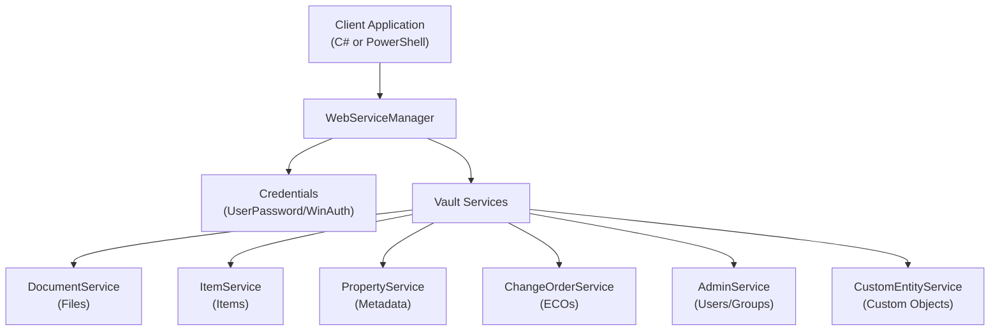

# Autodesk Vault API - Developer Onboarding Guide

**Version:** 2026 (API 31.0.84.0)  
**Author:** Markus Koechl  
**Copyright:** © Autodesk 2025

---

## Table of Contents

1. [Introduction](#introduction)
2. [Prerequisites](#prerequisites)
3. [Core Concepts](#core-concepts)
4. [Getting Started](#getting-started)
5. [Authentication Methods](#authentication-methods)
6. [Working with Vault Services](#working-with-vault-services)
7. [Common Operations](#common-operations)
8. [Advanced Topics](#advanced-topics)
9. [Best Practices](#best-practices)
10. [Troubleshooting](#troubleshooting)

---

## Introduction

The Autodesk Vault API provides programmatic access to Vault Professional, enabling developers to automate workflows, integrate with external systems, and extend Vault functionality. This guide covers both **C# (.NET)** and **PowerShell** implementations.

### What You Can Do with Vault API

- Connect to Vault servers and authenticate users
- Search, retrieve, and manage files, items, and custom objects
- Update properties and metadata
- Create and manage change orders (ECOs)
- Promote files to items
- Execute custom workflows and automation
- Display Vault dialogs in standalone applications

---

## Prerequisites

### Required Software

1. **Autodesk Vault Professional 2026** (Client and/or Server)
2. **Autodesk Vault 2026 SDK** (installed with Vault Client)
3. **Development Environment:**
   - **C#:** Visual Studio 2022 or later
   - **PowerShell:** PowerShell 5.1 or PowerShell 7.x

### SDK Location

The Vault SDK assemblies are located at:
- **x64 Assemblies:** `C:\Program Files\Autodesk\Autodesk Vault 2026 SDK\bin\x64\`
- **Core Assemblies (for .NET Core/PowerShell 7):** `C:\Program Files\Autodesk\Autodesk Vault 2026 SDK\bin\x64\Core\`

### Key Assemblies

- `Autodesk.Connectivity.WebServices.dll` - Core web services
- `Autodesk.Connectivity.WebServicesTools.dll` - Helper utilities
- `Autodesk.DataManagement.Client.Framework.dll` - Client framework
- `Autodesk.DataManagement.Client.Framework.Vault.dll` - Vault-specific functionality
- `Autodesk.DataManagement.Client.Framework.Vault.Forms.dll` - UI dialogs

### Licensing Requirements

**Click Licensing v9** requires:
- `AdskLicensingSDK_9.dll`
- `AdskIdentitySDK.config`
- `AdskIdentitySDK.dll`

**For PowerShell:**
- Copy these DLLs to `C:\Windows\System32\WindowsPowerShell\v1.0\` (PowerShell 5.1)
- Or to `C:\Program Files\PowerShell\7\` (PowerShell 7.x) along with `Ijwhost.dll`

---

## Core Concepts

### Architecture

Vault API uses a **service-oriented architecture** with the following key components:



### Key Classes

#### 1. **ServerIdentities**
Identifies the Vault server endpoints.

```csharp
ServerIdentities serverId = new ServerIdentities();
serverId.DataServer = "localhost";
serverId.FileServer = "localhost";
```

#### 2. **Credentials**
Authentication credentials for connecting to Vault.

**Types:**
- `UserPasswordCredentials` - Username/password authentication
- `WinAuthCredentials` - Windows authentication

#### 3. **LicensingAgent**
Specifies the license type to consume.

```csharp
LicensingAgent.Client    // Named User (Autodesk ID)
LicensingAgent.Server    // Legacy Multi-User
LicensingAgent.None      // Read-only access
LicensingAgent.Token     // Autodesk ID token
```

#### 4. **WebServiceManager**
Central manager for all Vault services. Must be disposed to release licenses.

```csharp
WebServiceManager vault = new WebServiceManager(credentials);
// ... perform operations
vault.Dispose(); // Always dispose!
```

---

## Getting Started

### Minimal C# Example

```csharp
using Autodesk.Connectivity.WebServices;
using Autodesk.Connectivity.WebServicesTools;

class Program
{
    static void Main(string[] args)
    {
        // Step 1: Configure server
        ServerIdentities serverId = new ServerIdentities();
        serverId.DataServer = "localhost";
        serverId.FileServer = "localhost";
        
        // Step 2: Create credentials
        UserPasswordCredentials cred = new UserPasswordCredentials(
            serverId, 
            "Vault",        // Vault name
            "Administrator", // Username
            "",             // Password
            LicensingAgent.Client
        );
        
        // Step 3: Connect to Vault
        WebServiceManager vault = new WebServiceManager(cred);
        
        // Step 4: Use Vault services
        long userId = vault.AuthService.Session.User.Id;
        Console.WriteLine($"Connected as User ID: {userId}");
        
        // Step 5: Always dispose
        vault.Dispose();
    }
}
```

### Minimal PowerShell Example

```powershell
# Step 1: Load assemblies
[System.Reflection.Assembly]::LoadFrom('C:\Program Files\Autodesk\Autodesk Vault 2026 SDK\bin\x64\Autodesk.Connectivity.WebServices.dll')

# Step 2: Configure server
$serverID = New-Object Autodesk.Connectivity.WebServices.ServerIdentities
$serverID.DataServer = "localhost"
$serverID.FileServer = "localhost"

# Step 3: Create credentials
$cred = New-Object Autodesk.Connectivity.WebServicesTools.UserPasswordCredentials(
    $serverID, 
    "Vault",        # Vault name
    "Administrator", # Username
    "",             # Password
    [Autodesk.Connectivity.WebServices.LicensingAgent]::Client
)

# Step 4: Connect to Vault
$vault = New-Object Autodesk.Connectivity.WebServicesTools.WebServiceManager($cred)

# Step 5: Use Vault services
$userId = $vault.AuthService.Session.User.Id
Write-Host "Connected as User ID: $userId"

# Step 6: Always dispose
$vault.Dispose()
```

---

## Authentication Methods

### 1. Username/Password Authentication

**C#:**
```csharp
UserPasswordCredentials cred = new UserPasswordCredentials(
    serverId, 
    vaultName, 
    userName, 
    password, 
    LicensingAgent.Client
);
WebServiceManager vault = new WebServiceManager(cred);
```

**PowerShell:**

```powershell
$cred = New-Object Autodesk.Connectivity.WebServicesTools.UserPasswordCredentials(
    $serverID, $VaultName, $UserName, $password, $licenseAgent
)
$vault = New-Object Autodesk.Connectivity.WebServicesTools.WebServiceManager($cred)
```

### 2. Windows Authentication

**C#:**
```csharp
WinAuthCredentials winCred = new WinAuthCredentials(
    serverId, 
    vaultName, 
    null,  // Uses current Windows user
    LicensingAgent.Client
);
WebServiceManager vault = new WebServiceManager(winCred);
```

**PowerShell:**

```powershell
$winCred = New-Object Autodesk.Connectivity.WebServicesTools.WinAuthCredentials(
    $serverID, $VaultName, $null, $licenseAgent
)
$vault = New-Object Autodesk.Connectivity.WebServicesTools.WebServiceManager($winCred)
```

### 3. Interactive Login Dialog (C# Only)

Using Vault Forms Library for user-friendly login:

```csharp
using VDF = Autodesk.DataManagement.Client.Framework;

// Initialize Forms Library
VDF.Forms.Library.Initialize();

// Show login dialog
LoginSettings loginSettings = new LoginSettings();
VDF.Vault.Currency.Connections.Connection conn = 
    VDF.Vault.Forms.Library.Login(loginSettings);

if (conn != null)
{
    WebServiceManager vault = conn.WebServiceManager;
    // ... perform operations
}

// Close all connections
VDF.Vault.Library.ConnectionManager.CloseAllConnections();
```

**PowerShell with Auto-Login:**
```powershell
Add-Type -Path "...\Autodesk.DataManagement.Client.Framework.Vault.Forms.dll"

$settings = New-Object Autodesk.DataManagement.Client.Framework.Vault.Forms.Settings.LoginSettings 
$settings.PersistenceKey = "MyAppKey"
$settings.AutoLoginMode = "RestoreAndExecute"

$connection = [Autodesk.DataManagement.Client.Framework.Vault.Forms.Library]::Login($settings)
$vault = $connection.WebServiceManager

# ... operations

[Autodesk.DataManagement.Client.Framework.Vault.Forms.Library]::Logout($connection)
```

### 4. Secondary Login (Multiple Contexts)

Useful for scenarios requiring different user permissions:

```powershell
# Primary login
$cred1 = New-Object Autodesk.Connectivity.WebServicesTools.UserPasswordCredentials(...)
$vault1 = New-Object Autodesk.Connectivity.WebServicesTools.WebServiceManager($cred1)

# Check if file is accessible
$file = $vault1.DocumentService.FindLatestFilesByPaths(@("$/Designs/File.ipt"))[0]

if ($file.Locked -eq $true) {
    # Secondary login with elevated permissions
    $cred2 = New-Object Autodesk.Connectivity.WebServicesTools.UserPasswordCredentials(...)
    $vault2 = New-Object Autodesk.Connectivity.WebServicesTools.WebServiceManager($cred2)
    
    # Perform operation with elevated user
    # ...
    
    $vault2.Dispose()
}

$vault1.Dispose()
```

---

## Working with Vault Services

### Available Services

Access services through `WebServiceManager`:

| Service | Purpose |
|---------|---------|
| `DocumentService` | File operations (search, download, checkout) |
| `ItemService` | Item management and file-to-item promotion |
| `PropertyService` | Property definitions and values |
| `ChangeOrderService` | ECO/ECR management |
| `AdminService` | User, group, and security administration |
| `CustomEntityService` | Custom object operations |
| `KnowledgeVaultService` | Vault and system options |
| `NumberingService` | Numbering scheme operations |
| `CategoryService` | Category management |
| `AuthService` | Session and authentication info |

---

## Common Operations

### 1. Search for Files

**C#:**
```csharp
// Simple path-based search
string[] filePaths = new string[] { "$/Designs/Test.ipt" };
File[] files = vault.DocumentService.FindLatestFilesByPaths(filePaths);

// Advanced search with conditions
SrchCond searchCondition = new SrchCond();
PropDef[] propDefs = vault.PropertyService.GetPropertyDefinitionsByEntityClassId("FILE");
PropDef nameProp = propDefs.Where(p => p.SysName == "Name").FirstOrDefault();

searchCondition.PropDefId = nameProp.Id;
searchCondition.SrchOper = 3; // Contains
searchCondition.SrchTxt = "*.ipt";
searchCondition.PropTyp = PropertySearchType.SingleProperty;
searchCondition.SrchRule = SearchRuleType.Must;

SrchStatus searchStatus = null;
string bookmark = string.Empty;
File[] results = vault.DocumentService.FindFilesBySearchConditions(
    new SrchCond[] { searchCondition },
    null,
    new long[] { vault.DocumentService.GetFolderRoot().Id },
    true,
    true,
    ref bookmark,
    out searchStatus
);
```

**PowerShell:**

```powershell
# Simple search
$filePaths = @("$/Designs/Test.ipt")
$files = $vault.DocumentService.FindLatestFilesByPaths($filePaths)

# Advanced search
$srchCond = New-Object Autodesk.Connectivity.WebServices.SrchCond
$propDefs = $vault.PropertyService.GetPropertyDefinitionsByEntityClassId("FILE")
$nameProp = $propDefs | Where-Object { $_.SysName -eq "Name" }

$srchCond.PropDefId = $nameProp.Id
$srchCond.SrchOper = 3
$srchCond.SrchTxt = "*.ipt"
$srchCond.PropTyp = [Autodesk.Connectivity.WebServices.PropertySearchType]::SingleProperty
$srchCond.SrchRule = [Autodesk.Connectivity.WebServices.SearchRuleType]::Must

$searchStatus = New-Object Autodesk.Connectivity.WebServices.SrchStatus
$bookmark = ""
$results = $vault.DocumentService.FindFilesBySearchConditions(
    @($srchCond), 
    $null, 
    @($vault.DocumentService.GetFolderRoot().Id), 
    $true, 
    $true, 
    [ref]$bookmark, 
    [ref]$searchStatus
)
```

### 2. Get and Update File Properties

**C#:**
```csharp
// Get file
File file = vault.DocumentService.FindLatestFilesByPaths(
    new string[] { "$/Designs/Test.idw" }
).FirstOrDefault();

// Get property definitions
PropDef[] propDefs = vault.PropertyService.GetPropertyDefinitionsByEntityClassId("FILE");
PropDef partNumberProp = propDefs.Where(p => p.SysName == "PartNumber").FirstOrDefault();

// Get current properties
PropInst[] propInsts = vault.PropertyService.GetPropertiesByEntityIds(
    "FILE", 
    new long[] { file.Id }
);

// Update using ExplorerUtil (requires Vault Client 2026 Update 1)
using ACET = Autodesk.Connectivity.Explorer.ExtensibilityTools;

VDF.Vault.Currency.Connections.Connection conn = // ... your connection
ACET.IExplorerUtil explorerUtil = ACET.ExplorerLoader.LoadExplorerUtil(
    conn.Server, conn.Vault, conn.UserID, conn.Ticket
);

Dictionary<PropDef, object> propDict = new Dictionary<PropDef, object>();
propDict.Add(partNumberProp, "NEW-12345");
explorerUtil.UpdateFileProperties(file, propDict);
```

### 3. Create and Retrieve Custom Object Properties

**C#:**
```csharp
// Find custom entities
string[] customObjectNumbers = new string[] { "WG110000036", "WG110000037" };
CustEnt[] custEnts = vault.CustomEntityService.FindCustomEntitiesByNumbers(customObjectNumbers);
long[] custEntIds = custEnts.Select(ce => ce.Id).ToArray();

// Get property definitions and instances
PropDef[] propDefs = vault.PropertyService.GetPropertyDefinitionsByEntityClassId("CUSTENT");
PropInst[] propInsts = vault.PropertyService.GetPropertiesByEntityIds("CUSTENT", custEntIds);

// Build name-value dictionary
Dictionary<string, Dictionary<string, object>> nameValueMap = 
    new Dictionary<string, Dictionary<string, object>>();

foreach (long custEntId in custEntIds)
{
    Dictionary<string, object> properties = new Dictionary<string, object>();
    
    foreach (PropDef propDef in propDefs)
    {
        PropInst propInst = propInsts.FirstOrDefault(
            pi => pi.PropDefId == propDef.Id && pi.EntityId == custEntId
        );
        
        if (propInst != null)
        {
            properties.Add(propDef.DispName, propInst.Val);
        }
    }
    
    string custEntNum = custEnts.FirstOrDefault(ce => ce.Id == custEntId).Num;
    nameValueMap.Add(custEntNum, properties);
}
```

**PowerShell:**

```powershell
$customObjects = @("WG110000036", "WG110000037")
$custEnts = $vault.CustomEntityService.FindCustomEntitiesByNumbers($customObjects)
$custEntIds = $custEnts | ForEach-Object { $_.Id }

$propDefs = $vault.PropertyService.GetPropertyDefinitionsByEntityClassId("CUSTENT")
$propInsts = $vault.PropertyService.GetPropertiesByEntityIds("CUSTENT", $custEntIds)

$customObjectNameValueMap = @{}

foreach ($custEntId in $custEntIds) {
    $nameValueMap = @{}
    foreach ($propDef in $propDefs) {
        $propInst = $propInsts | Where-Object { 
            $_.PropDefId -eq $propDef.Id -and $_.EntityId -eq $custEntId 
        } | Select-Object -First 1
        
        if ($null -ne $propInst) {
            $nameValueMap[$propDef.DispName] = $propInst.Val
        }
    }
    
    $custEnt = $custEnts | Where-Object { $_.Id -eq $custEntId } | Select-Object -First 1
    $customObjectNameValueMap[$custEnt.Num] = $nameValueMap
}
```

### 4. Promote Files to Items

**C#:**
```csharp
// Get files to promote
string primaryFile = "$/Designs/Test.ipt";
File primFile = vault.DocumentService.FindLatestFilesByPaths(
    new string[] { primaryFile }
).FirstOrDefault();

VDF.Vault.Currency.Entities.FileIteration primFileIt = 
    new VDF.Vault.Currency.Entities.FileIteration(conn, primFile);

// Add files to promote queue
List<long> fileIdsToPromote = new List<long>();
fileIdsToPromote.Add(primFileIt.EntityIterationId);

ItemAssignAll itemAssignAll = ItemAssignAll.No;

try
{
    vault.ItemService.AddFilesToPromote(fileIdsToPromote.ToArray(), itemAssignAll, true);
    
    DateTime timeStamp = DateTime.Now;
    GetPromoteOrderResults promoteOrder = vault.ItemService.GetPromoteComponentOrder(out timeStamp);
    
    // Promote primary components
    if (promoteOrder.PrimaryArray != null && promoteOrder.PrimaryArray.Length > 0)
    {
        vault.ItemService.PromoteComponents(timeStamp, promoteOrder.PrimaryArray);
    }
    
    // Promote non-primary (secondary) components
    if (promoteOrder.NonPrimaryArray != null && promoteOrder.NonPrimaryArray.Length > 0)
    {
        vault.ItemService.PromoteComponentLinks(promoteOrder.NonPrimaryArray);
    }
    
    // Get results and commit
    ItemsAndFiles promoteResult = vault.ItemService.GetPromoteComponentsResults(timeStamp);
    
    if (promoteResult.ItemRevArray.FirstOrDefault().Locked != true)
    {
        Item currentItem = promoteResult.ItemRevArray.FirstOrDefault();
        vault.ItemService.UpdateAndCommitItems(new Item[] { currentItem });
    }
}
catch (Exception ex)
{
    // Handle errors and rollback if needed
    // vault.ItemService.UndoEditItems(...)
}
```

### 5. Create Change Orders (ECOs)

**C#:**
```csharp
// Get default workflow and routing
Workflow coWorkflow = vault.ChangeOrderService.GetDefaultWorkflow();
Routing coRouting = vault.ChangeOrderService.GetRoutingsByWorkflowId(coWorkflow.Id)
    .Where(r => r.IsDflt)
    .FirstOrDefault();

// Get numbering scheme and generate number
NumSchm coNumSchm = vault.NumberingService.GetNumberingSchemes("CO", NumSchmType.SystemDefault)
    .Where(n => n.IsDflt)
    .FirstOrDefault();
string newNumber = vault.NumberingService.GenerateNumberBySchemeId(coNumSchm.SchmID, null);

// Set ECO details
string title = "C# Sample ECO";
string description = "Sample automation";
DateTime dueDate = DateTime.Now.AddMonths(1);

// Create ECO
ChangeOrder changeOrder = vault.ChangeOrderService.AddChangeOrder(
    coRouting.Id,
    newNumber,
    title,
    description,
    dueDate,
    new long[] { },  // Item IDs
    new long[] { },  // File attachment IDs
    new long[] { },  // File IDs
    new PropInst[] { },     // Properties
    new AssocPropItem[] { }, // Item association properties
    new MsgGroup[] { },      // Comments
    new Email[] { }          // Emails
);
```

### 6. Administrative Operations

**Query Group Membership:**
```csharp
Group group = vault.AdminService.GetGroupByName("Configuration Administrators");
GroupInfo groupInfo = vault.AdminService.GetGroupInfoByGroupId(group.Id);

long currentUserId = vault.AdminService.Session.User.Id;
bool isMember = groupInfo.Users.Any(u => u.Id == currentUserId);
```

**PowerShell:**

```powershell
$group = $vault.AdminService.GetGroupByName("Configuration Administrators")
$groupInfo = $vault.AdminService.GetGroupInfoByGroupId($group.Id)

$currentUserId = $vault.AdminService.Session.User.Id
$isMember = $groupInfo.Users | Where-Object { $_.Id -eq $currentUserId }
```

### 7. Create Items with Custom Categories and Numbering

**PowerShell:**
```powershell
# Get category
$categories = $vault.CategoryService.GetCategoriesByEntityClassId("ITEM", $true)
$categoryId = ($categories | Where-Object { $_.Name -eq "Part" }).ID

# Create item (Step 1)
$newItem = $vault.ItemService.AddItemRevision($categoryId)
$newItem.Title = "My Part"
$newItem.Detail = "Created via API"
$vault.ItemService.UpdateAndCommitItems(@($newItem))

# Update category to add UDPs (Step 2)
$savedItem = $vault.ItemService.GetLatestItemByItemMasterId($newItem.MasterId)
$editItem = $vault.ItemService.EditItems(@($savedItem.RevId))[0]
$updatedItem = $vault.ItemService.UpdateItemCategories(
    @($editItem.MasterId), 
    @($categoryId), 
    "Item with category UDPs"
)[0]
```

---

## Advanced Topics

### 1. Using Vault Dialogs in Standalone Applications

**Initialize VDF Forms Library:**
```csharp
// Apply theme and initialize
VDF.Forms.Library.Initialize();
VDF.Forms.SkinUtils.CustomThemeSkins.Register();

// Set theme
this.LookAndFeel.SetSkinStyle(VDF.Forms.SkinUtils.CustomThemeSkins.DarkThemeName);
```

**Select Entity Dialog:**
```csharp
// Configure settings
VDF.Vault.Forms.Settings.SelectEntitySettings settings = new();
settings.DialogCaption = "Select an Inventor File...";
settings.ActionableEntityClassIds.Add("FILE");
settings.MultipleSelect = false;
settings.ShowFolderView = true;
settings.ConfigureRevisions(true, true, true);
settings.PersistenceKey = "MyApp-SelectEntity";

// Add filters
List<SelectEntitySettings.EntityRegularExpressionFilter> filters = new();
filters.Add(new SelectEntitySettings.EntityRegularExpressionFilter(
    "Inventor Parts (*.ipt)", 
    @"^.*\.ipt$", 
    EntityClassIds.Files
));

settings.ConfigureFilters("File Types", filters, null);

// Show dialog
SelectEntityResults result = VDF.Vault.Forms.Library.SelectEntity(conn, settings);

if (result != null && !string.IsNullOrEmpty(result.SelectionText))
{
    // Process selected entities
    foreach (var entity in result.SelectedEntities)
    {
        Console.WriteLine(entity.Name);
    }
}
```

**Custom Help Provider:**
```csharp
internal class CustomHelpProvider : ICustomHelpProvider
{
    public bool CanShowHelp(string helpId, object helpContext)
    {
        return true;
    }

    public void ShowHelp(string helpId, object helpContext)
    {
        VDF.Forms.Library.ShowMessage(
            "Help Display", 
            $"Context: {helpContext}", 
            VDF.Forms.Currency.ButtonConfiguration.Ok
        );
    }
}

// Register provider
Autodesk.DataManagement.Client.Framework.Forms.Library.ApplicationConfiguration.CustomHelpProvider = 
    new CustomHelpProvider();
```

### 2. Thin Client Links

Generate URLs to open entities in Thin Client:

**PowerShell:**
```powershell
$serverUri = [System.Uri]$vault.InformationService.Url

# Folder link
$folder = $vault.DocumentService.GetFolderByPath("$/Designs")
$folderLink = "$($serverUri.Scheme)://$($serverID.DataServer)/AutodeskTC/$($VaultName)/explore/folder/$($folder.Id)"
Start-Process $folderLink

# File master link
$file = $vault.DocumentService.FindLatestFilesByPaths(@("$/Designs/Test.ipt"))[0]
$fileMasterLink = "$($serverUri.Scheme)://$($serverID.DataServer)/AutodeskTC/$($VaultName)/explore/file/$($file.MasterId)"
Start-Process $fileMasterLink

# Item link
$item = $vault.ItemService.GetItemsByFileId($file.Id)[0]
$itemLink = "$($serverUri.Scheme)://$($serverID.DataServer)/AutodeskTC/$($VaultName)/items/item/$($item.MasterId)"
Start-Process $itemLink

# Change Order link
$co = $vault.ChangeOrderService.GetChangeOrderFilesByFileMasterId($file.MasterId)[0]
$coLink = "$($serverUri.Scheme)://$($serverID.DataServer)/AutodeskTC/$($VaultName)/changeorders/changeorder/$($co.ChangeOrder.Id)"
Start-Process $coLink
```

### 3. Vault and System Options

**Get/Set Vault Options:**
```csharp
// Get option
string optionValue = conn.WebServiceManager.KnowledgeVaultService.GetVaultOption("OptionName");

// Set option
conn.WebServiceManager.KnowledgeVaultService.SetVaultOption("OptionName", "OptionValue");
```

**Save/Load Settings:**
```csharp
[XmlRoot("settings")]
public class Settings
{
    [XmlElement("ActiveTheme")]
    public string Theme;

    public bool SaveToVault(Connection connection)
    {
        using (StringWriter writer = new StringWriter())
        {
            XmlSerializer serializer = new XmlSerializer(typeof(Settings));
            serializer.Serialize(writer, this);
            string settingsString = writer.ToString();
            connection.WebServiceManager.KnowledgeVaultService.SetVaultOption(
                "MyAppSettings", 
                settingsString
            );
        }
        return true;
    }

    public static Settings LoadFromVault(Connection connection)
    {
        string settingsString = connection.WebServiceManager.KnowledgeVaultService.GetVaultOption("MyAppSettings");
        
        using (StringReader reader = new StringReader(settingsString))
        {
            XmlSerializer serializer = new XmlSerializer(typeof(Settings));
            return (Settings)serializer.Deserialize(reader);
        }
    }
}
```

---

## Best Practices

### 1. Always Dispose WebServiceManager

**C#:**
```csharp
WebServiceManager vault = null;
try
{
    vault = new WebServiceManager(cred);
    // ... operations
}
finally
{
    vault?.Dispose(); // Releases license
}
```

**PowerShell:**

```powershell
try {
    $vault = New-Object Autodesk.Connectivity.WebServicesTools.WebServiceManager($cred)
    # ... operations
}
finally {
    if ($vault) { $vault.Dispose() }
}
```

### 2. Handle Exceptions Gracefully

```csharp
try
{
    File file = vault.DocumentService.FindLatestFilesByPaths(paths).FirstOrDefault();
}
catch (Autodesk.Connectivity.WebServices.VaultServiceErrorException ex)
{
    Console.WriteLine($"Vault Error {ex.ErrorCode}: {ex.Message}");
}
catch (Exception ex)
{
    Console.WriteLine($"Unexpected Error: {ex.Message}");
}
```

### 3. Use Paging for Large Search Results

```csharp
SrchStatus searchStatus = null;
string bookmark = string.Empty;
List<File> allResults = new List<File>();

do
{
    File[] pageResults = vault.DocumentService.FindFilesBySearchConditions(
        conditions,
        null,
        folderIds,
        true,
        true,
        ref bookmark,
        out searchStatus
    );
    
    allResults.AddRange(pageResults);
}
while (searchStatus.TotalHits > allResults.Count);
```

### 4. Verify Indexing Status

```csharp
if (searchStatus.IndxStatus == IndexStatus.IndexingComplete || 
    searchStatus.IndxStatus == IndexStatus.IndexingContent)
{
    // Safe to use results
}
else
{
    // Warn user that index is incomplete
}
```

### 5. Rollback on Errors

```csharp
Item[] updatedItems = null;
try
{
    updatedItems = vault.ItemService.EditItems(itemIds);
    // ... modifications
    vault.ItemService.UpdateAndCommitItems(updatedItems);
}
catch (Exception)
{
    if (updatedItems != null)
    {
        long[] itemMasterIds = updatedItems.Select(i => i.MasterId).ToArray();
        vault.ItemService.UndoEditItems(itemMasterIds);
    }
    throw;
}
```

### 6. Use Currency Framework for High-Level Operations

```csharp
using VDF = Autodesk.DataManagement.Client.Framework;

VDF.Vault.Currency.Connections.Connection conn = 
    new VDF.Vault.Currency.Connections.Connection(
        vault, 
        vaultName, 
        userId, 
        serverName, 
        AuthenticationFlags.Standard
    );

VDF.Vault.Currency.Entities.FileIteration fileIt = 
    new VDF.Vault.Currency.Entities.FileIteration(conn, file);
```

---

## Troubleshooting

### Common Issues

#### 1. **"Could not load file or assembly" Error**

**Solution:** Ensure all required DLLs are in the same folder or registered in GAC. For PowerShell, copy DLLs to PowerShell execution folder.

#### 2. **Licensing Errors**

**Solution:** 
- Verify Click Licensing DLLs are copied to PowerShell folder
- Ensure license agent is correct (`Client`, `Server`, `None`)
- Always call `vault.Dispose()` to release licenses

#### 3. **"Item is locked by another user"**

**Solution:**
- Check `item.Locked` property before editing
- Use `UndoEditItems()` to release locks on error
- Consider secondary login with elevated permissions

#### 4. **Search Returns Incomplete Results**

**Solution:**
- Check `searchStatus.IndxStatus`
- Use paging with bookmarks for large result sets
- Verify search conditions are correctly configured

#### 5. **PowerShell 7.x Assembly Loading Issues**

**Solution:**
- Use assemblies from `SDK\bin\x64\Core\` folder
- Copy `Ijwhost.dll` to PowerShell installation folder
- Use `Add-Type -Path` instead of `[Reflection.Assembly]::LoadFrom`

---

## Sample Code Structure

### Recommended Project Structure (C#)

```
MyVaultApp/
??? Program.cs              # Entry point
??? VaultConnection.cs      # Connection management
??? Services/
?   ??? FileService.cs      # File operations
?   ??? ItemService.cs      # Item operations
?   ??? PropertyService.cs  # Property operations
??? Models/
?   ??? VaultFile.cs        # Data models
?   ??? VaultItem.cs
??? Utilities/
    ??? ErrorHandler.cs     # Exception handling
    ??? Logger.cs           # Logging
```

### PowerShell Script Template

```powershell
#region disclaimer
#===============================================================================
# PowerShell script sample
# Author: Your Name
# Copyright (c) Company 2025
#
# THIS SCRIPT/CODE IS PROVIDED "AS IS" WITHOUT WARRANTY OF ANY KIND
#===============================================================================
#endregion

#region ConnectToVault
# Load assemblies
[System.Reflection.Assembly]::LoadFrom('...\Autodesk.Connectivity.WebServices.dll')

# Configure connection
$serverID = New-Object Autodesk.Connectivity.WebServices.ServerIdentities
$serverID.DataServer = "localhost"
$serverID.FileServer = "localhost"

$cred = New-Object Autodesk.Connectivity.WebServicesTools.UserPasswordCredentials(...)
$vault = New-Object Autodesk.Connectivity.WebServicesTools.WebServiceManager($cred)

#region ExecuteInVault
try {
    # Your code here
}
finally {
    $vault.Dispose()
}
#endregion ExecuteInVault

#endregion ConnectToVault
```

---

## Resources

### Documentation
- **Vault API Help:** Installed with SDK at `C:\Program Files\Autodesk\Autodesk Vault 2026 SDK\help\`
- **DevExpress Documentation:** https://docs.devexpress.com/
- **Autodesk Platform Services:** https://aps.autodesk.com/

### Sample Code Repository
Your current repository contains comprehensive samples covering:
- File operations
- Item management
- Property updates
- Change order creation
- Custom objects
- Administrative tasks
- UI dialogs

### Support
- **Autodesk Forums:** https://forums.autodesk.com/
- **GitHub Issues:** Use your repository's issue tracker

---

## Disclaimer

**THIS CODE AND INFORMATION ARE PROVIDED "AS IS" WITHOUT WARRANTY OF ANY KIND, EITHER EXPRESSED OR IMPLIED, INCLUDING BUT NOT LIMITED TO THE IMPLIED WARRANTIES OF MERCHANTABILITY AND/OR FITNESS FOR A PARTICULAR PURPOSE.**

All code samples are for educational and demonstration purposes. Always test in a non-production environment before deploying to production Vaults.

---

## Version History

| Version | Date | Changes |
|---------|------|---------|
| 31.0.84.0 | 2025 | Vault 2026 API samples |

---

**End of Documentation**
